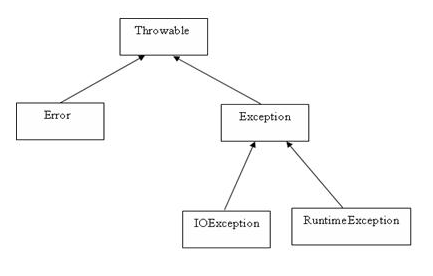

# 1.异常分类
1. 检查性异常(Exception)：编译时检查得到，不可简单忽略，必须捕获
2. 运行时异常(RuntimeException 编译时检查不到
)：与检查性异常相反，运行时异常可以在编译时被忽略。
3. 错误（Error 编译时检查不到）：错误不是异常，而是脱离程序员控制的问题。错误在代码中通常被忽略。例如，当栈溢出时，一个错误就发生了，它们在编译也检查不到的。
# 2. 继承关系

# 3. 自定义异常
1. 运行时异常继承RuntimeException，可以不捕获
```java
// 运行时异常，编译时候忽略，调用时可以不捕获
class ExceptionA extends RuntimeException{
    String desc;
    public ExceptionA(String desc){
        this.desc = desc;
    }
}

Class A{
    public func1() throws ExceptionA{
        throw new ExceptionA("ExceptionA");
    }
}

class Main{
    public static void main(String [] args){

        A a = new A();
        // 不捕获
        a.func1()
       
        
    }
}
```

2. 检查性异常继承Exception，必须捕获
```java
// 检查性异常，编译时不忽略，调用时候必须捕获
class ExceptionA extends Exception{
    String desc;
    public ExceptionA(String desc){
        this.desc = desc;
    }
}

Class A{
    public func1() throws ExceptionA{
        throw new ExceptionA("ExceptionA");
    }
}

class Main{
    public static void main(String [] args){

        A a = new A();
        // 捕获
        try{
            a.func1()
        }catch(ExceptionA e){
             e.printStackTrace();
        }
        
    }
}
```
