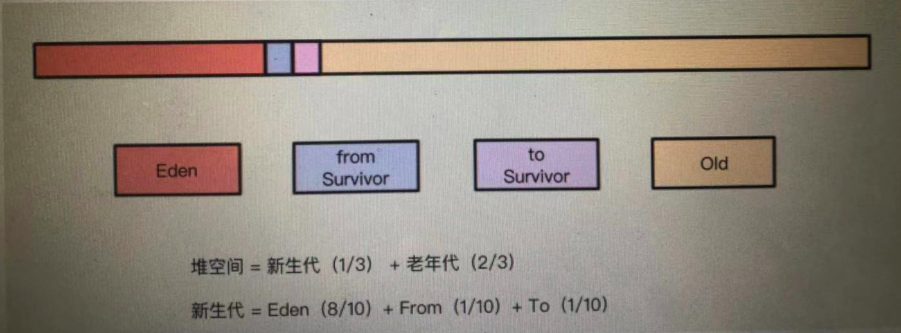

# 0. jvm内存
<br>
1. 堆内存： 线程之间共享；储存对象和数组；垃圾回收的主要地方。JVM将Heap分为两块：新生代New Generation和旧生代Old Generation<br>
2. 虚拟机栈：每个线程独享；每个方法被执行都会创建一个栈贞帧（Stack Frame）用于存储局部变量表、操作数栈、动态链接、方法出口等信息<br>
3. 本地方法栈:和上面一样，只要为java本地方法服务<br>
4. 方法区：线程独享；存储类信息，常量，类变量等<br>
5. 程序计数器：线程独享,记录每个线程执行到的位置

# 1. 哪些垃圾可以回收
## 1.1 引用计数法。
+ 在对象头中分配一个空间保存该对象被引用的次数。每引用一次计数器加1，删除该对象的引用计数器-1. 当该对象的引用计数为0时，该对象可以回收
+ 缺点：两个不可能再访问的对象互相引用，这两个垃圾不能回收（**循环依赖**）

## 1.2 可达性分析（根搜索）
+ 从一些被称为引用链(GC Roots)的对象向下搜索。当一个对象到gc-roots没有任何引用链相连时，证明该对象不可达，可以被回收。
+ 解决了**循环依赖问题**。
* 哪些对象可以作为(gc roots)?
```
4种
(1)虚拟机栈（栈贞中的本地变量表）中引用的对象
(2)方法区中静态属性引用的对象
(3)方法区中常量引用的对象
(4)本地方法中JNI（Native方法）引用的对象
```
# 2. 怎样回收
## 2.1 标记清除算法
1. 标记清除算法：<br>（1）将内存区域可回收的对象做标记<br>（2）标记完后，将标记的的对象清除。<br>缺点：产生内存碎片
2. 标记整理：<br>
(1)将内存区域的对象做标记<br>
(2)将所有存活的对象移到一端<br>
(3)清除“未存活”的对象<br>
缺点：效率毕复制算法差很多
3. 复制算法<br>
(1) 将内存划分为等大小的两块，每次只是用其中一块<br>
(2) 当一块内存使用完时，将活着的对象移到另一块<br>
优点：效率高，缺点：浪费内存
4. java分代收集算法<br>
(1)将java堆内存划分为新生代和老年代，根据各代的特点采用不同的收集算法<br>
(2)新生代：每次收集都有大批对象死去，只有少量存活。使用复制算法，付出少量存活对象的复制成本就可以完成收集<br>
(3)老年代的存活率高，无额外空间对其分配。所以使用标记-整理<br>

# 3. java内存模型和回收策略

1. 上图为java堆的结构，新生代：老年代=1:2 新生代中（eden:suvivor_from:suvivor_to=8:1:1）
2. 通过minor gc,eden区将被清空，绝大多数对象将被回收，存活的对象将移动到suvivor from(from不够直接进入old)
3. 为啥要两个suvivor(from and to)?每次minor gc,会将eden,from中存活的移动到to(如果to区不够直接进入old),下一次，会将suvivor和to中存活的对象移动到from(from不够直接进入old),循环反复
4. 为什么不直接送入old？因为这样会让old区域的对象急剧增加，触发major gc(full gc)。起到suvivor起到一个缓冲作用。经过16次minor gc还存活的对象才回被送入 old 区域
5. old区（老年代）回收，老年代存活率较高，使用复制需要进行多次复制，浪费空间，所以用标记整理算法。 触发major gc(full gc)需要stop-the-world.内存越大，stop时间越长

# 4. 什么时候回收
 + eden区满了触发minor gc
 + old区满了触发major gc

# 5.old区特殊对象
+ 大对象：指需要连续内存空间的对象，为了避免eden suvivor之间大量的复制，这部分对象将直接放入old区域
+ 长期存活对象：eden suvivor之间移动一次年龄+1，移动15次之后被挪到old区
+ 动态对象年龄：并不一定要等对象到15岁才移动。当对象大于eden的平均年龄就可以移动了

# 6. 常用垃圾收集器
serial, parallel old