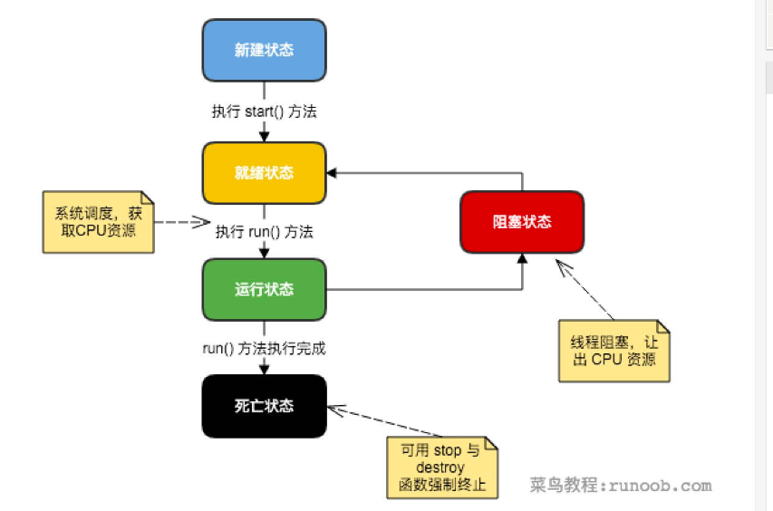

# 1. 多线程实现方式
1. Thread继承
```java

```
2. 实现Runnable
3. Callable/Future
```java
// 这是一个泛型接口，call()函数返回的类型就是传递进来的V类型。
public interface Callable<V> {

    V call() throws Exception;
}

// Callable一般情况下是配合ExecutorService,submit方法里面的参数类型就是Callable。
<T> Future<T> submit(Callable<T> task);
<T> Future<T> submit(Runnable task, T result);
Future<?> submit(Runnable task);

// Future就是对于具体的Runnable或者Callable任务的执行结果进行取消、查询是否完成、获取结果。
public interface Future<V> {
    boolean cancel(boolean mayInterruptIfRunning);
    boolean isCancelled();
    boolean isDone();
    V get() throws InterruptedException, ExecutionException;
    V get(long timeout, TimeUnit unit)
        throws InterruptedException, ExecutionException, TimeoutException;
}
```
# 2. 多线程的方法
1. interrupte:<br>如果线程处于阻塞状态，中断阻塞，抛出InterruptedException异常；
<br>如果线程处于运行状态，那么会将该线程的中断标志设置为 true。
<br>运行状态的线程，经常检查本线程的中断标志位，如果被设置了中断标志就自行停止线程。
2. thread.sleep（）:<br>
线程处于阻塞状态，睡眠结束后回答就绪状态
3. thread.join（）:<br>
主线程等待子线程运行结束再运行
4. thread.yield（）:
<br>让出cpu，回到就绪状态，可能会马上被cpu重新调度
5. object.wait()/object.notify():主要用于线程间通信
<br>(1)两个需要和synchronized（object）一起使用
<br>(2)wait():释放锁，在当前位置停住，等待唤醒;
<br>(3)notify():走完当前synchronized块后，释放锁，并且唤醒别的的wait()
```java

public class PrintABC implements Runnable{
    private String name;
    private Object prev;
    private Object self;

    public PrintABC(String name,Object prev,Object self){
        this.name=name;
        this.prev = prev;
        this.self = self;
    }

    @Override
    public void run() {
        int count = 3;
        while (count > 0) {
            synchronized (prev) {
                synchronized (self) {
                    System.out.print(name);
                    count--;

                    self.notify();// 走完本次synchronized后释放锁，
                }
                try {
                    prev.wait();// 线程在这个地方停住,等待唤醒;1000是防止最后死锁
                } catch (InterruptedException e) {
                    e.printStackTrace();
                    System.out.println("已捕获");
                }
            }

        }

    }

    public static void main(String[] args) throws Exception{

        Object a = new Object();
        Object b = new Object();
        Object c = new Object();

        Thread thread1 = new Thread(new PrintABC("A", c, a));
        Thread thread2 = new Thread(new PrintABC("B", a, b));
        Thread thread3 = new Thread(new PrintABC("C", b, c));

        thread1.start();
        Thread.sleep(10);
        thread2.start();
        Thread.sleep(10);
        thread3.start();
        Thread.sleep(10);

        //中断线程
        thread2.interrupt();
        thread3.interrupt();
    }
}

```


# 参考
 