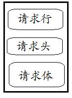

# 1.TCP/UDP协议
## 1.1 TCP与UDP简介
1.TCP是一种面向字节流，**面向连接**的，**可靠**的协议
 
2.UDP是面向报文，**无连接**、**不可靠**的协议

##1.2 TCP与UDP区别，优缺点（各自的优点是对方的缺点）
1.TCP:提供确认序列号，确认号，超时重传,也是通过此保证传输的可靠性。UDP不提供。
 
2.TCP:只支持单播（点对点）； UDP:支持单播，广播和组播
 
3.TCP:保证传输数据的顺序和不重复；UDP不保证
 
4.相比于UDP,TCP传输效率更低，耗费资源更大（三次握手和四次挥手）

## 1.3 TCP和UDP运用场景
1.TCP在通讯质量要求高的时候使用.如：http,SMTP（邮件服务），FTP，ssh
 
2.UDP通讯质量要求不高，网络速度要求高的时候使用。如:语音，视频

## 1.4 TCP三次握手和四次挥手
1. **三次握手** 
第一次：客户端向服务端发送(SYN=1, seq=x)，客户端进入SYN_SEND状态 
第二次：服务端回传(SYN=1, ACK=1, seq=y, ACKnum=x+1):服务器端进入 SYN_RCVD 状态 
第三次：客户端回传(ACK=1，ACKnum=y+1)，发送完毕后，客户端进入 ESTABLISHED 状态，
当服务器端接收到这个包时，也进入 ESTABLISHED 状态，TCP 握手结束。 
示意图: 

2. **四次挥手** 
第一次挥手(FIN=1，seq=x)，客户端进入 FIN_WAIT_1 状态不能再发送数据 
第二次挥手(ACK=1，ACKnum=x+1)，服务器端进入 CLOSE_WAIT 状态。客户端接收到这个确认包之后，
进入 FIN_WAIT_2 状态，等待服务器端关闭连接。 
第三次挥手(FIN=1，seq=y),服务器端准备好关闭连接时，向客户端发送结束连接请求 
第四次挥手(ACK=1，ACKnum=y+1)服务器端接收到这个确认包之后，关闭连接，进入 CLOSED 状态。 
示意图： 

## 1.5 TCP SYN攻击(一种典型的 DoS/DDoS 攻击)
1. 什么是SYN攻击 
三次握手中，当服务端发送确认包后进入半🔗链接状态。SYN 攻击指的是，攻击客户端在短时间内伪造大量不存在的IP地址，向服务器不断地发送SYN包，
服务器回复确认包，并等待客户的确认。此时会在服务端堆积大量半链接的请求，由于源地址是不存在的，服务器需要不断的重发直至超时，
这些伪造的SYN包将长时间占用未连接队列，正常的SYN请求被丢弃，导致目标系统运行缓慢，严重者会引起网络堵塞甚至系统瘫痪。 
2. 如何检测 SYN 攻击？ 当你在服务器上看到大量的**半连接状态**时，特别是源IP地址是随机的，基本上可以断定这是一次SYN攻击。
在 Linux/Unix 上可以使用系统自带的 netstats 命令来检测 SYN 攻击。 
3. 如何防御？  
(1)缩短超时（SYN Timeout）时间,这样可在很大程度上增加废除SYN请求的速度 
(2)增加最大半连接数 
(3)过滤网关防护 
(4)SYN cookies技术

## 1.6 TCP keepAlive 
客户端和服务端之间发送探测包（心跳包），不断确认对方还活着 

# 2.http协议

## 2.1 HTTP/0.9(1991年)

* 不涉及数据包（packet）传输，主要规定了客户端和服务器之间的通信格式（仅支持HTML字符串）

* 只有GET命令

* 一次http请求响应结束后就断开TCP连接

## 2.2 HTTP/1.0（1996）

* 支持GET,POST,HEAD

* 可发送多种格式的内容（视频、图片等）

* 每次通信都必须包括头信息（HTTP header）,头信息必须是 ASCII 码，后面的数据可以是任何格式

* 缺点：每个TCP连接只能发送一个请求。发送数据完毕，连接就关闭，如果还要请求其他资源，就必须再新建一个连接。为了解决这个问题，有些浏览器在请求时，用了一个非标准的Connection字段，服务器同样回应这个字段。（Connection: keep-alive）一个可以复用的TCP连接就建立了，直到客户端或服务器主动关闭连接。但是，这不是标准字段，不同实现的行为可能不一致，因此不是根本的解决办法。

## 2.3 HTTP/1.1 (1997)

* 增加 PUT、PATCH、HEAD、 OPTIONS、DELETE。

* 引入**持久连接**，即TCP连接默认不关闭，可以被多个请求复用，不用声明Connection: keep-alive。

* 引入**管道机制**，即在同一个TCP连接里面，客户端可以同时发送多个请求，管道机制则是允许浏览器同时发出A请求和B请求，但是服务器还是按照顺序，先回应A请求，完成后再回应B请求。改善了http的效率。新增Content-Length字段，指定每次请求响应的数据长度，区分数据包是属于哪一个回应的。

* 引入**分块传输编码**，对于很耗时的操作，服务器要等到所有操作完成，才能发送数据，显然这样的效率不高。更好的处理方法是，产生一块数据，就发送一块，采用"流模式"（stream）取代"缓存模式"（buffer）。1.1版规定可以不使用Content-Length字段.只要请求或回应的头信息有Transfer-Encoding字段，就表明回应将由数量未定的数据块组成。每个非空的数据块之前，会有一个16进制的数值，表示这个块的长度。最后是一个大小为0的块，就表示本次回应的数据发送完了

* 缺点：虽然1.1版允许复用TCP连接，但是同一个TCP连接里面，所有的数据通信是按次序进行的。服务器只有处理完一个回应，才会进行下一个回应。要是前面的回应特别慢，后面就会有许多请求排队等着。这称为"队头堵塞"（Head-of-line blocking）。为了避免这个问题，只有两种方法：一是减少请求数，二是同时多开持久连接。

## 2.4 HTTP/2(2015)
* 引入**二进制**，HTTP/1.1 版的头信息肯定是文本（ASCII编码），数据体可以是文本，也可以是二进制。HTTP/2 则是一个彻底的二进制协议，头信息和数据体都是二进制，并且统称为"帧"（frame）：头信息帧和数据帧。

* 引入**多工**，双向的、实时的通信，就叫做多工（Multiplexing）。在一个连接里，客户端和浏览器都可以同时发送多个请求或回应，而且不用按照顺序一一对应，这样就避免了"队头堵塞"。

* 引入**数据流**因为 HTTP/2 的数据包是不按顺序发送的，同一个连接里面连续的数据包，可能属于不同的回应。因此，必须要对数据包做标记，指出它属于哪个回应。HTTP/2 将每个请求或回应的所有数据包，称为一个数据流（stream）。每个数据流都有一个独一无二的编号。数据包发送的时候，都必须标记数据流ID，用来区分它属于哪个数据流。另外还规定，客户端发出的数据流，ID一律为奇数，服务器发出的，ID为偶数。客户端还可以指定数据流的优先级。优先级越高，服务器就会越早回应。

* 引入**头信息压缩**，HTTP 协议不带有状态，每次请求都必须附上所有信息。所以，请求的很多字段都是重复的，比如Cookie和User Agent，一模一样的内容，每次请求都必须附带，这会浪费很多带宽，也影响速度。
HTTP/2 对这一点做了优化，引入了头信息压缩机制（header compression）。一方面，头信息使用gzip或compress压缩后再发送；另一方面，客户端和服务器同时维护一张头信息表，所有字段都会存入这个表，生成一个索引号，以后就不发送同样字段了，只发送索引号，这样就提高速度了。

* 引入**服务器主动推送**，服务器可以主动向客户端推送内容

## 2.5 HTTP request/response header
1. HTTP请求报文由3部分组成（请求行+请求头+请求体）：  
 

2. 以下是一个实际的请求报文
 
(1)POST:请求方法/请求url/http协议版本 
(2)ACCEPT: 客户端接受什么类型的响应 
(3)COOKIE:客户端保存服务端生成的cookie对象 
(4)REFERER:表示这个请求是从哪个URL过来的 
(5)Cache-Control:该响应在本地要不要缓存 
3. HTTP的响应报文也由三部分组成（响应行+响应头+响应体）

4. 以下是一个实际的HTTP响应报文： 
 
(1)Content-Type:响应内容格式 
(2)Transfer-Encoding: chunked,表示该响应分块传输

# 3.参考
* >https://hit-alibaba.github.io/interview/basic/network/TCP.html
* >https://blog.csdn.net/u013777351/article/details/49226101
* >http://www.ruanyifeng.com/blog/2016/08/http.html
* >https://blog.csdn.net/u010256388/article/details/68491509

                                             
                    
